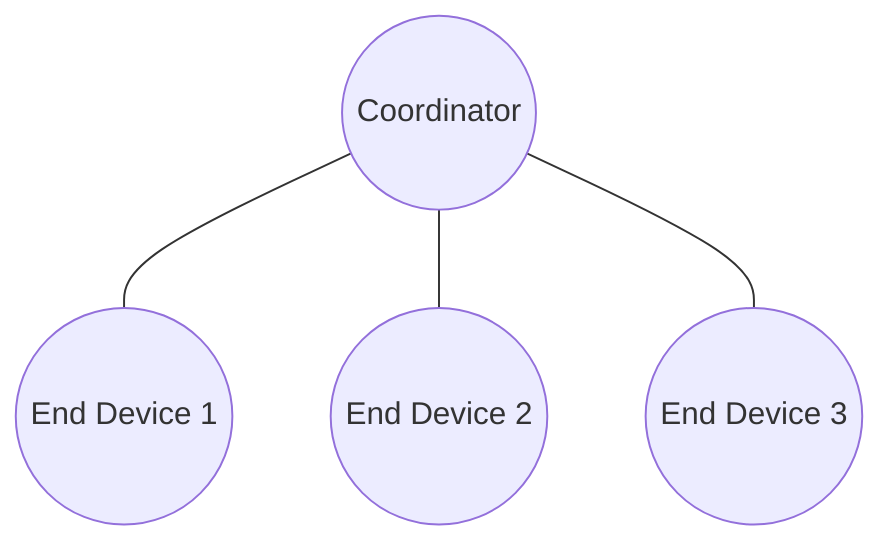
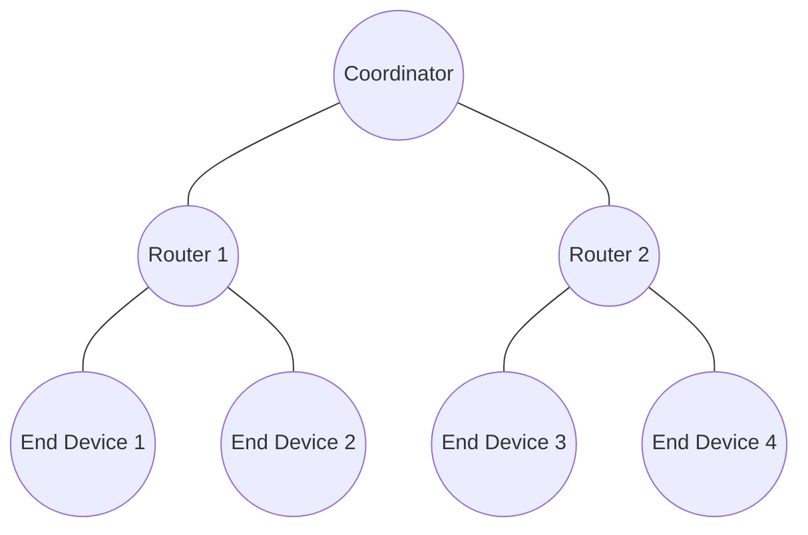
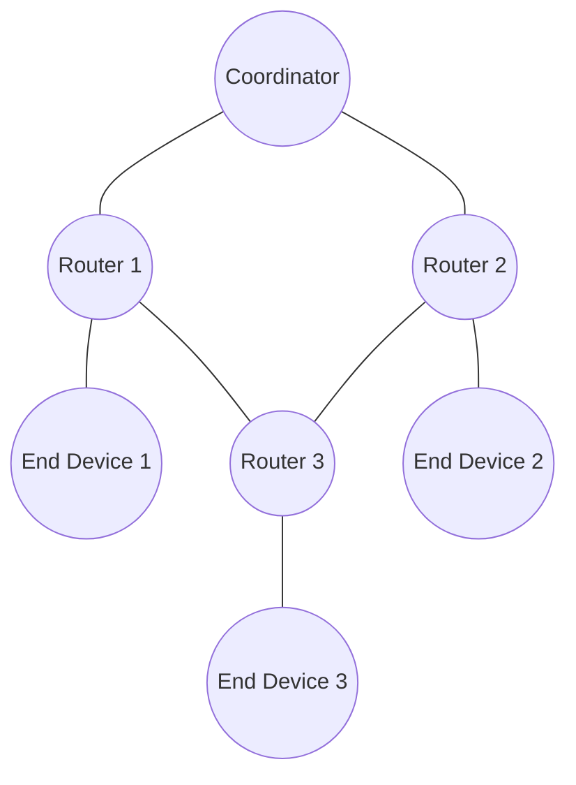

[[Zigbee - Quick Review]]

Zigbee 是一种低功耗、低数据速率、短距离的无线通信协议，常用于物联网（IoT）设备之间的通信，如[[Smart Home|智能家居]]、工业自动化、传感器网络等

## 核心特点

- **低功耗**：Zigbee 设备在长时间不使用时会进入休眠模式，非常适合电池供电的设备。
- **低数据速率**：传输速率为 20 kbps 到 250 kbps，适用于小数据量的传输。
- **短距离通信**：传输范围通常为 10 米到 100 米，支持多跳（Mesh 网络）扩展覆盖范围。
- **Mesh 网络拓扑**：Zigbee 支持星型（Star）、树型（Tree）和网状（Mesh）网络结构，具备自修复能力，网络非常可靠。
- **开放标准**：基于 IEEE [[802.15.4]] 标准，工作在 2.4 GHz 全球通用频段，也支持 868 MHz（欧洲）和 915 MHz（北美）。

## 网络架构

不同于 [[LoRaWAN]] 那样采用分层但用了星型网络的架构。仅靠终端节点、网关、(网络/应用)服务器这样的非常清晰明了的架构；

Zigbee 基于 [[Mesh]] 的网络拓扑会有如下三个设备角色：

- **协调器（Coordinator）**
    - 每个 Zigbee 网络只有一个协调器。
    - 负责初始化和管理网络，分配网络地址，并作为数据通信的网关。
    - 具有完整的 Zigbee 协议栈。
    - 通常连接到外部网络（如 Wi-Fi 或以太网），实现跨网络通信。
- **路由器（Router）**
    - 用于转发数据包，扩展网络覆盖范围。
    - 可以与其他设备通信，作为中继节点帮助数据在网络中传输。
    - 支持低功耗设备，但通常需要持续供电。
- **终端设备（End Device）**
    - 仅与父节点（协调器或路由器）通信。
    - 功耗最低，适合电池供电的设备（如传感器）。
    - 不参与数据转发，通常处于睡眠状态以节省能量。

根据上述特性同样可以实现三种网络拓扑方式：星型、树型和网状。

### 1. 星型网络拓扑 (Star Topology)

### 2. 树型网络拓扑 (Tree Topology)

### 3. 网状网络拓扑 (Mesh Topology)

只有**Coordinator（协调器）** 和 **Router（路由器）** 会参与 Hopping。
## Arduino - ESP32 C6

Zigbee 角色分为三个：ED（End Device）、ZC/ZR（协调器/路由器）、RCP（无线协处理器）

### 1. **Zigbee ED（终端设备）**

- **角色：**  
    Zigbee 终端设备是 Zigbee 网络中最简单的节点。它只与其父节点（路由器或协调器）通信，并且不为其他设备路由数据。
- **特点：**
    - 功耗低，非常适合电池供电设备。
    - 仅与父节点交换数据，不能管理或控制其他设备。
- **应用场景：**
    - 传感器、开关或其他需要简单通信的设备。

---

### 2. **Zigbee ZC/ZR（协调器/路由器）**

- **ZC（Zigbee 协调器）：**
    - **角色：**  
        Zigbee 网络的中央控制节点，负责创建并维护网络。
    - **特点：**
        - 每个 Zigbee 网络中只能有一个协调器。
        - 为网络中的设备分配地址。
        - 负责管理网络的安全性和拓扑结构。
    - **应用场景：**
        - 智能家居中的中央网关或工业自动化的控制中心。
- **ZR（Zigbee 路由器）：**
    - **角色：**  
        扩展网络范围，通过路由数据连接其他设备。
    - **特点：**
        - 通过转发消息来构建 Mesh 网状网络。
        - 自身也可以作为其他设备的父节点（例如协调器或其他路由器的子节点）。
    - **应用场景：**
        - 中继设备，信号扩展器。

---

### 3. **Zigbee RCP（无线协处理器）**

- **角色：**  
    RCP 模式将 Zigbee 的网络任务从主处理器卸载到专用的 Zigbee 芯片上。
- **特点：**
    - 采用分布式架构，主处理器运行应用程序，RCP 处理 Zigbee 协议栈。
    - 通常通过 UART、SPI 或 USB 等接口与主处理器通信。
- **应用场景：**
    - 高级 Zigbee 应用，例如需要主处理器处理复杂任务，同时将 Zigbee 协议操作委托给 RCP。
    - 与 OpenThread 或 Matter 等系统集成（当 Zigbee 被支持时）。

---

### 这些模式如何协作

- 一个 Zigbee 网络通常包括 **一个协调器（ZC）**、多个 **路由器（ZR）** 和许多 **终端设备（ED）**。
- **RCP 模式** 是一种架构选择，而不是 Zigbee 网络中的功能角色。它主要用于需要复杂系统分工的场景，其中 Zigbee 设备需要在主处理器和 Zigbee 芯片之间分配任务。

### 采用点对点的方式

如果不需要比较复杂的组网方式，可以先采用 P2P 的方式实现两个设备的通信，利用 Zigbee 网络的特性。

